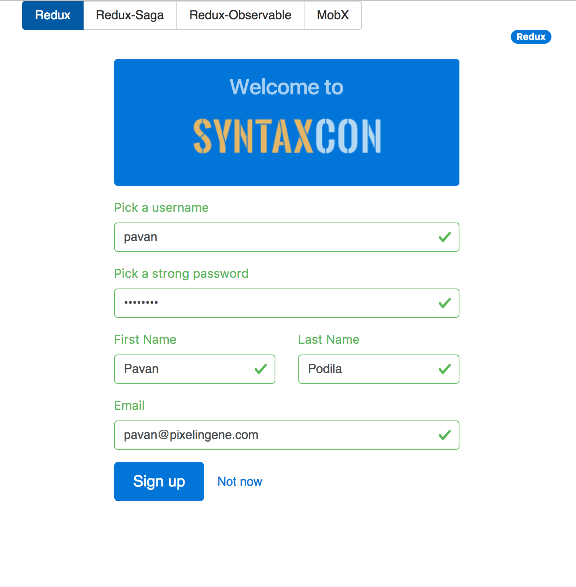

# react-state-mgmt
State of State Management in React (Talk)

> [Live Demo](https://react-state-mgmt-mmbwvcqnom.now.sh/)

> [Video -- will be uploaded later]

## Summary

This talk covers a variety of topics such as:

- _Component State_ vs _App State_
- The _Side-Effect model_ inside applications
- Using the _Form validation use case_ to show case various side effects
- Showing 4 different approaches to managing side effects with:
    + Vanilla Redux
    + Redux Saga
    + Redux Observables
    + MobX
- _Container_ vs _Presentation_ components
- Higher Order Components (HOC)    

## Uses

- react
- react-router v4
- redux (**middlewares**: thunks, batch, sagas, observables)
- mobx
- validate.js

